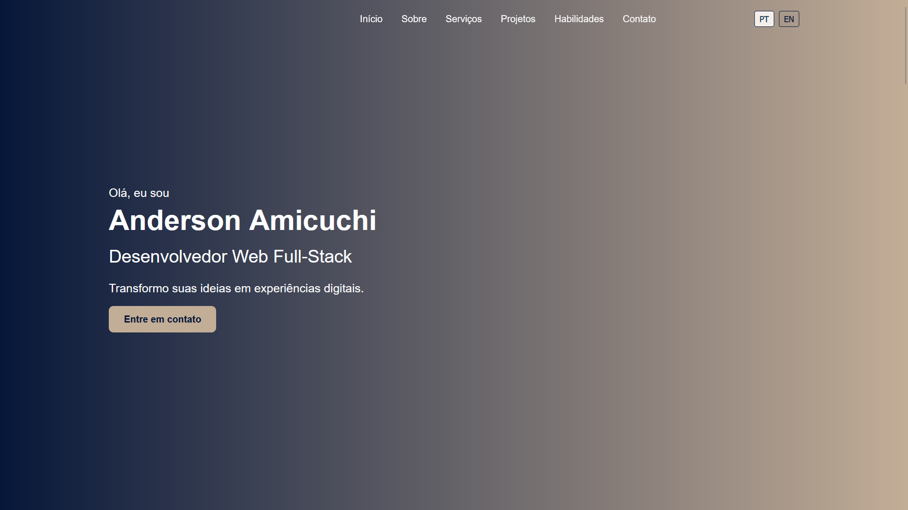
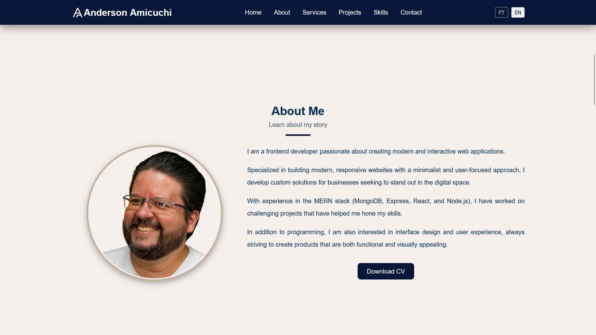
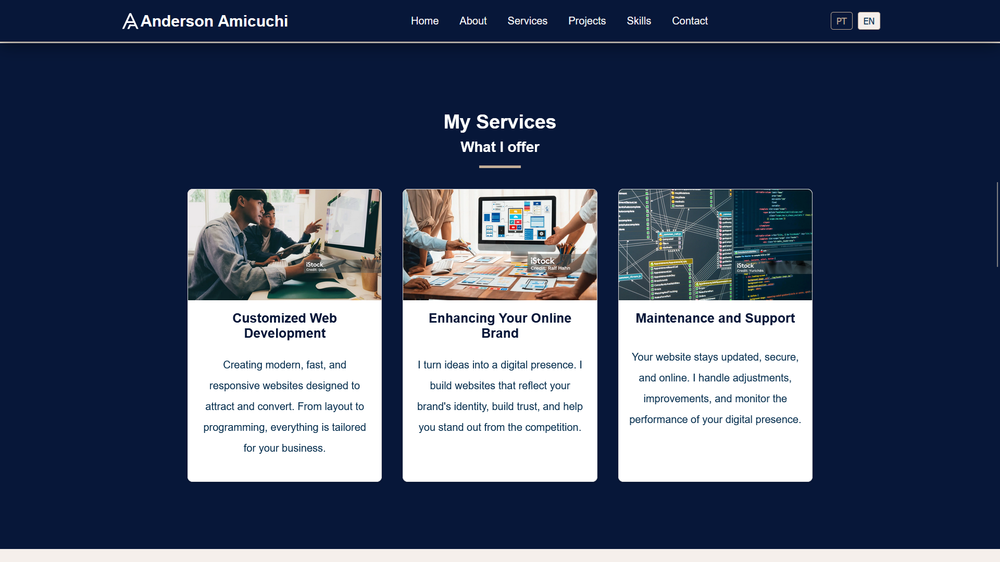
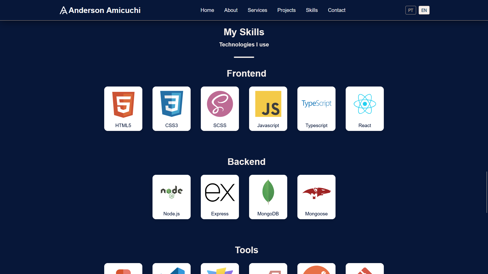
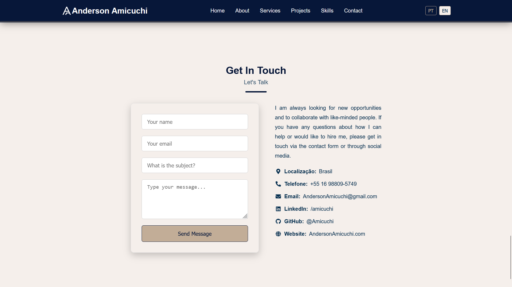

# Anderson Amicuchi | Portfólio de Desenvolvimento Web

 

Olá! Bem-vindo ao repositório do meu portfólio pessoal. Este projeto foi desenvolvido para apresentar minhas habilidades, experiências e projetos como Desenvolvedor Full Stack, com foco na stack MERN.

## ✨ Demonstração e Acesso ao Site

* **Site Online:** Você pode visitar e explorar o portfólio ativo em: [https://suaurlcompleta.com](https://suaurlcompleta.com)

* **Screenshots/Preview Visual:** Veja como algumas seções do site se parecem:

    **Seção Sobre Mim:**
    

    **Seção Projetos (Carrossel):**
    

    **Seção Serviços:**
    

    **Seção Habilidades:**
    

    **Seção Contato:**
    

    ## 🚀 Funcionalidades Principais

* Apresentação "Sobre Mim" com foto e breve descrição.
* Seção "Serviços" destacando minhas especialidades (Desenvolvimento Web, Frontend, Backend).
* Carrossel de "Projetos" interativo com cards flippáveis mostrando detalhes e links.
* Seção "Habilidades" exibindo as tecnologias com as quais trabalho.
* Formulário de "Contato" funcional para receber mensagens.
* Design completamente **responsivo** para desktop, tablet e mobile.
* Switch de idioma (Internacionalização - i18n).
* Header dinâmico que muda de estilo ao rolar a página.
* Otimizações básicas de SEO com Meta tags.

## 🛠️ Tecnologias Utilizadas

Este projeto foi construído utilizando as seguintes tecnologias e ferramentas:

* **Frontend:**
    * React 
    * SCSS Modules 
    * JavaScript (ES6+) 
    * HTML5 Semântico 
    * CSS3 
    * (Mencione outras libs de frontend como react-router-dom, react-icons, etc.)

* **Backend:** (Mencione se você tiver um backend ativo para o formulário ou outras partes)
    * Node.js 
    * Express.js 

* **Banco de Dados:** (Mencione se aplicável, mesmo que apenas para o formulário de contato)
    * MongoDB 

* **Ferramentas e Outros:**
    * Git 
    * GitHub 
    * VS Code 
    * SCSS (Sass) 

## ⚙️ Instalação e Configuração Local

Siga estes passos para ter uma cópia do projeto rodando na sua máquina local para desenvolvimento e testes.

### Pré-requisitos

Certifique-se de ter o Node.js e o npm (ou Yarn) instalados na sua máquina.

* Node.js: [https://nodejs.org/](https://nodejs.org/)
* npm (geralmente vem com Node.js) ou Yarn: [https://yarnpkg.com/](https://yarnpkg.com/)

### Passos

1.  Clone o repositório:

    ```bash
    git clone [https://github.com/Amicuchi/portfolio.git](https://github.com/Amicuchi/portfolio.git)
    ```

2.  Navegue até o diretório do projeto:

    ```bash
    cd seu-nome-do-repositorio
    ```

3.  Instale as dependências:

    ```bash
    npm install
    # ou
    yarn install
    ```

4.  **Configuração de Variáveis de Ambiente:**
    * Se o seu formulário de contato utiliza um serviço como Formspree, você precisará de um arquivo `.env` na raiz do projeto.
    * Crie um arquivo chamado `.env` na pasta raiz do projeto.
    * Adicione suas variáveis de ambiente. Por exemplo, para Formspree:
        ```env
        REACT_APP_FORMSPREE_KEY=sua_chave_publica_do_formspree
        # Adicione outras variáveis se necessário
        ```
    * **Importante:** O arquivo `.env` já deve estar listado no `.gitignore` para não ser commitado!

5.  Inicie o servidor de desenvolvimento:

    ```bash
    npm start
    # ou
    yarn start
    # (ou outro comando se você usar Vite, Next.js, etc. Ex: npm run dev)
    ```
O aplicativo deverá abrir no seu navegador em `http://localhost:5173` (ou outra porta).

## 🏃 Utilização

* Mude o idioma do site usando o seletor no header.
* Navegue entre as seções clicando nos links do header.
* Explore os projetos no carrossel.
* Utilize o formulário de contato para enviar uma mensagem.
* Teste a responsividade redimensionando a janela do navegador.

## ⏭️ Possíveis Melhorias Futuras

* Implementar animações mais complexas.
* Adicionar mais detalhes e funcionalidades aos projetos no carrossel.
* Criar páginas dedicadas para cada projeto.
* Implementar testes unitários/de integração.
* Melhorar ainda mais a performance e métricas Core Web Vitals.

## 📄 Licença

Este projeto está sob a Licença MIT.

## 🤝 Contato

* **Anderson Amicuchi**
* **LinkedIn:** [https://www.linkedin.com/in/Amicuchi/](https://www.linkedin.com/in/Amicuchi/)
* **GitHub:** [https://github.com/Amicuchi](https://github.com/Amicuchi)
* **Email:** AndersonAmicuchi@gmail.com
* **Website:** [https://AndersonAmicuchi.com](https://AndersonAmicuchi.com)

---